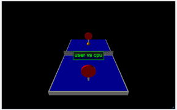
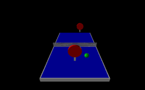
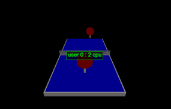

# vpython_pringpong [일반물리및시뮬레이션 과제5]

### 링크
[PLAY LINK (Web Vpython glowscript)](https://www.glowscript.org/#/user/wjdgotjd9908/folder/MyPrograms/program/Hw5)  

### 조작법
- 방향키 : 앞,뒤,좌,우 라켓 이동
- W, S : 상,하 라켓 이동
- A, D : 누른 상태로 공 라켓에 충돌시 좌,우 방향 조절

   